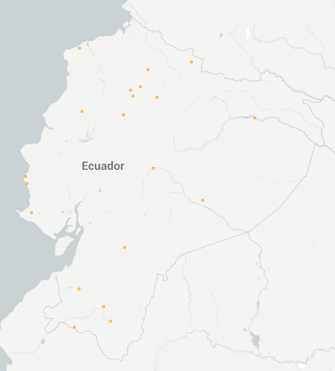
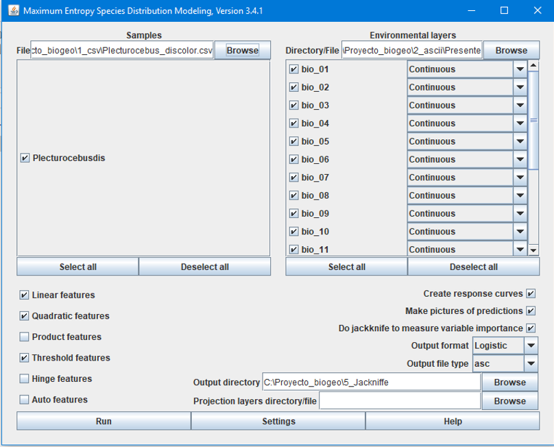
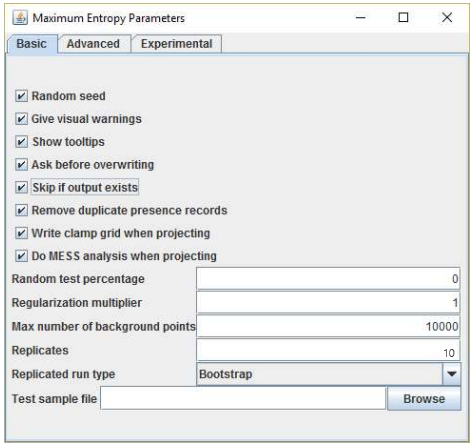
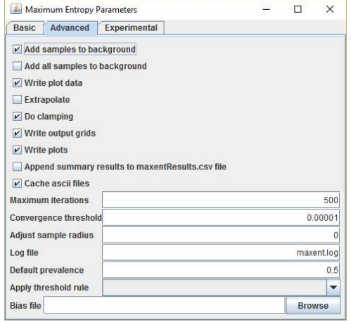
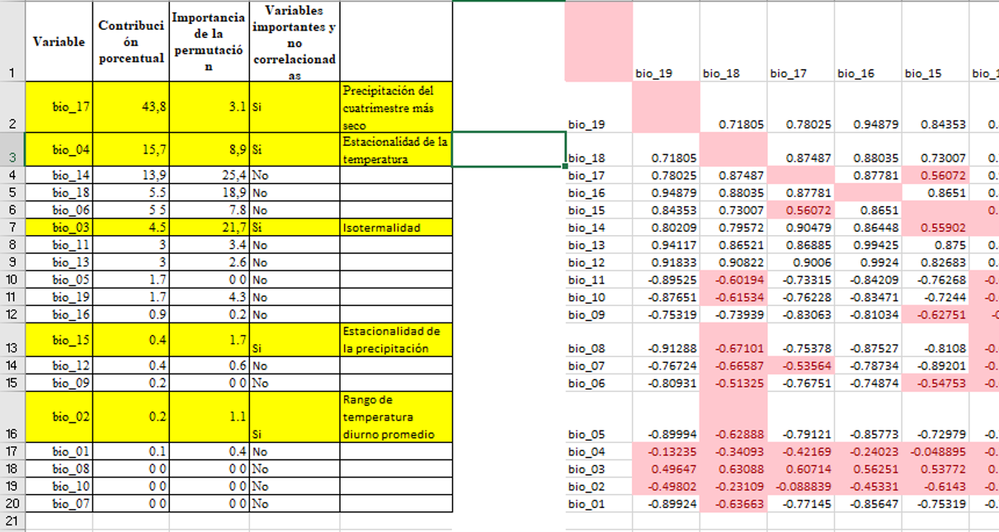
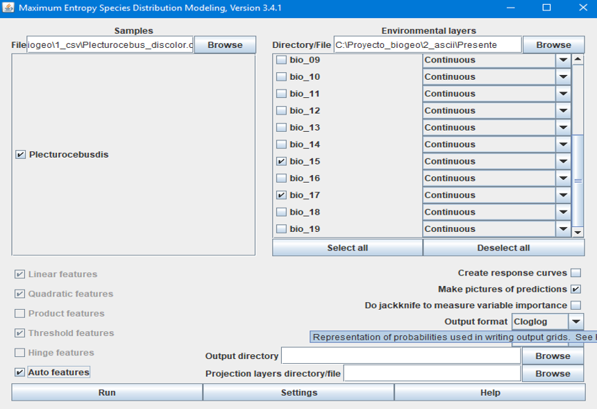
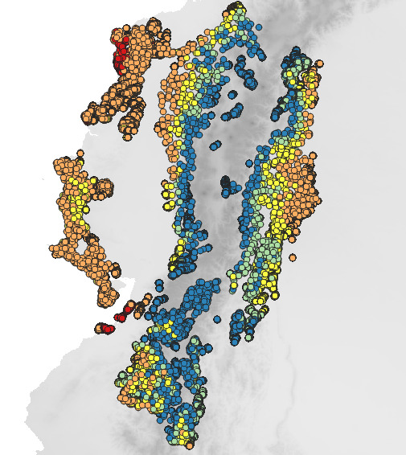

## Patrones  de distribución espacial del margen de seguridad térmica de *Danaus plexippus* (Mariposa Monarca) en Ecuador

**Autores:**  Nugra, M., Rueda, V., Tello, M., & Urbina, O.
**Objetivo:** 
Estimar los patrones de margen de seguridad térmica de *Danaus plexippus* de manera espacial en Ecuador.

# Métodos 

Utilizamos modelamiento ecológico junto con datos extraídos de la literatura de ensayos fisiológicos de la temperatura óptima de desempeño de la especie, para visualizar los patrones espaciales de distribución de la especie que garanticen condiciones óptimas para su supervivencia.  

# Obtención de datos
La base de datos de presencias georreferenciadas de esta especie se obtuvo de [GBIF](https://www.gbif.org/), [Monarch Watch](https://monarchwatch.org/) , [iNaturalist](https://www.inaturalist.org/) y [Natural History Museum](https://www.nhm.ac.uk/) (London) en formato  CSV (.csv)

En [QGis](https://www.qgis.org/es/site/) se abrió el archivo CSV para verificar que los datos de presencia obtenidos estén dentro de nuestra area geográfica de estudio (Ecuador) y en caso de que existan datos atípicos, debemos eliminarlos

Se obtuvo un registro de 96 datos de presencias de la especie en Ecuador.

Las variables climáticas fueron obtenidas de [WorldClim](https://www.worldclim.org/bioclim) para escenarios actuales y futuros de tipo extremo a nivel mundial (versión 1.4). Fueron escogidas 19 variables bioclimáticas (bios)  para el presente (2020) y el futuro (2050) del laboratorio CCSM4 en formato ráster (.tiff) a una resolución de 30 seg (≈1 Km).  

Con el software [ArcMap](https://desktop.arcgis.com/es/arcmap/) se cortaron las bios, con la capa de Ecuador como máscara, mediante la función Extrack by mask de la caja de herramientas.

    ArcToolbox/RasterTools/Extract by mask

# Modelamiento de nicho

En el software [MaxEnt3.3.3k ](http://www.cs.princeton.edu/~schapire/maxent/) se realizó el análisis de Jackkniffe para conocer cuál es la variable correlacionada que tiene mayor porcentaje de contribución . 

     Samples/archivo .csv de presencias    
     Environmental layers/cargar las 19 Bios del presente

En la siguiente imagen se detallan los parámetros que se deben seleccionar para correr el análisis.

En "Settings" tenemos que activar y configurar los parámetros como se describe en las siguiente imágenes.

    Setting/Basic

    Setting/Advanced

El resultado es una matriz con los valores de correlación de las bios. Se seleccionan las bios que no estén correlacionadas y tengan un buen aporte al modelo. 

Para generar el modelo, se cargan las bios del presente y se seleccionan las más importantes determinadas  en el paso anterior. Además debemos cargar nuestro archivo CSV de la especie y en la sección de "Projection layers directory file", añadimos nuestras bios del escenario futuro más importantes.

El resultado obtenido es un Excel con los resultados de los potenciales modelos. Se eligió el modelo que presentó un mayor valor de AUC.

# Patrones del margen de seguridad térmica (MST)

En  [ArcMap](https://desktop.arcgis.com/es/arcmap/) se crearon 300.000 puntos aleatorios dentro de los límites de la distribución  potencial de la especie obtenida con el modelo de nicho.

    ArcToolbox/Data Management Tools/Sampling/Create Random Points

Se cargó la capa Bio1 que contiene datos de temperatura media anual y sobre esta se proyectaron los puntos creados.

Se extrajeron los datos de la Bio1 para cada uno de los puntos aleatorios con la herramienta "Extraction/Extract Values to Points" , así cada punto tendrá el valor de la temperatura ambiental. 

     ArcToolbox/Spatial Analys Tools/Extraction/Extract Values to Points

En la calculadora Raster, restamos la temperatura óptima(Topt) obtenida de la literatura (27°C  para esta especie), menos la temperatura ambiental (Thab) de los puntos.

    ArcToolbox/Spatial Analys Tools/Map Algebra/Raster Calculator
    
                      MST = Topt – Thab
    Topt=temperatura óptima de desempeño fisiológico de la especie 
    Thab=temperatura climática actual

En la capa resultante, editamos sus propiedades para crear categorías y clasificarlas por color.

Los puntos con mayor valor de MST(azules) son lugares que presentan condiciones idóneas para que se desarrolle la especie. 

